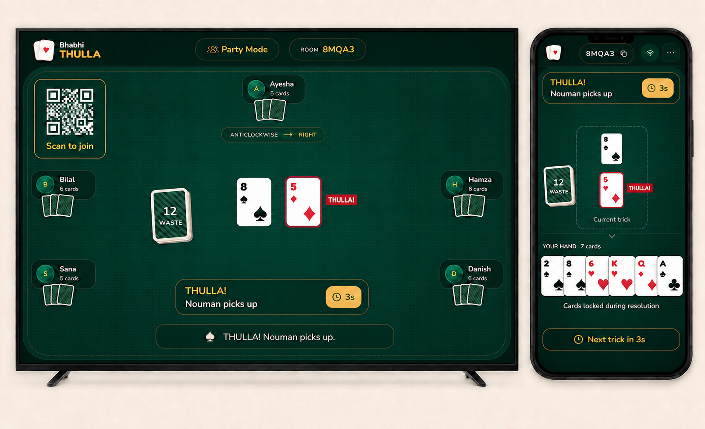

# Bhabhi Thulla Party / TV Mode

This package defines Party Mode. One shared screen becomes a public game board, while every player uses a phone as a private controller containing only that player's hand and actions.

## Implementation status

The Phase 1 backend foundation is implemented locally: additive shared contracts, authoritative room/board lifecycle, redacted board projections, Socket.IO role fencing, Redis-safe persistence, availability controls, and regression tests. Fresh creation remains disabled by default with `PARTY_MODE=off`, and nothing in this package has been deployed as part of that work.

The separate TV board, QR join flow, and phone-controller React interfaces are Phase 2 and are not yet exposed in the game UI.

## Documents

- [Complete implementation plan](./implementation-plan.md)
- [Realtime protocol, privacy, and Redis design](./protocol.md)
- [Responsive screen-by-screen wireframes](./wireframes.md)
- [QA, release, and rollback plan](./qa-rollout.md)

## Locked MVP decisions

- Party Mode is a separate landing-page option; the existing Online Mode remains unchanged.
- The board is display-only and never counts as a player.
- The board receives an explicit server-redacted view and never receives any private hand, legal-card IDs, player token, board token, or private chat history.
- A large QR code opens `/?room=ABCDE&mode=party`; it contains no secret credential.
- The first phone to join is the player host and starts/configures the game from that phone.
- Existing host-managed bots remain optional: at least one human phone is required and humans plus bots must total 3–8 active seats.
- The same authoritative Pakistani rules engine, anticlockwise/right-hand direction, THULLA behavior, timers, late joining, bots, rematches, and Redis durability continue to apply.
- Board disconnection does not pause the match; phones can continue while the board reconnects.
- Backend support is released first behind the additive `party-v1` capability; `partyMode: off | beta | public` controls exposure before the static frontend is made public.

The concept image is illustrative. The written protocol, game rules, responsive states, and acceptance criteria are authoritative.
